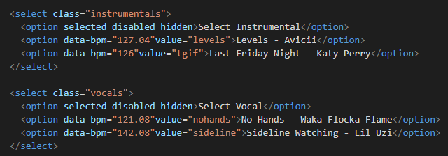
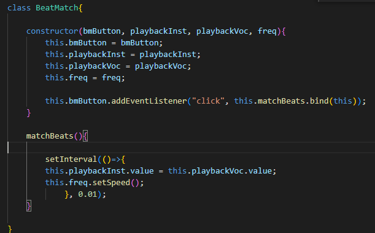
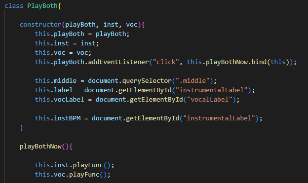
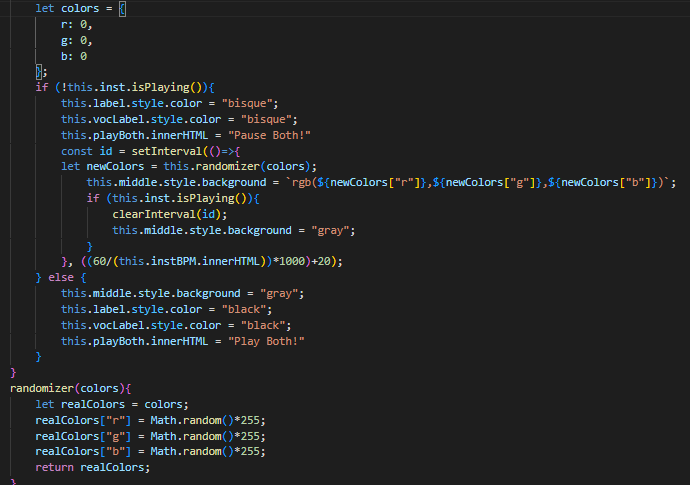

# Mashed - Julian Cardone

Background:
Mashed is a browser tool to mash up songs. The user may select one song from a list of instrumental audio tracks
and another song from a list of acappella audio tracks of popular songs. Once selected, the user may change the tempo of one or both songs. The final product is an overlay of the two tracks to create a 'mashup' of the two songs. 

Functionality & MVPs:
In Mashed, users are able to:

- select from a list of popular songs, instrumental
- select from a list of popular songs, vocals
    
- be able to edit the tempo of each audio track. This can be done individually or synchronously though the 'Match BPMs' button. This is accomplished through creating a interval to constantly update the bpms of the instrumental song (the tempo changes as the user changes the vocal BPMs).
    
- overlay the audio to create a mashup. The 'playboth' button plays both of the audio tracks at the same time in order to overlay the songs. 
    
- cool background lights!! this is accomplished by creating a color randomizer to display different colors on the beat.
    

In addition, this project will include the following:

- instructions
- a readme

Technologies, Libraries, APIs:

- Web Audio API
- webpack
- npm

Implementation Timeline:

Friday Afternoon & Weekend:
- I will use these days to familiarize myself with the libraries and APIs
- setup the project and begin making basic classes
Monday:
- set up the functionality of the audio editing. Implement the list of songs
Tuesday:
- be able to overlay the audio tracks and edit them by the end of the day. 
Wednesday
- work on the interface
- finishing touches on the interface. if there is time, implement bonus features
Thursday Morning
- adjust readme if necessary. Deploy the finished product!

Bonus features:
I have lots of plans for bonus features for this app, including but not limited to the following:
- the ability to look up and select any song that you would like
- the ability to further edit audio tracks 
- instruments and samples to be added to tracks
- an interface to manage different parts of the track
- ability to download your created mashups